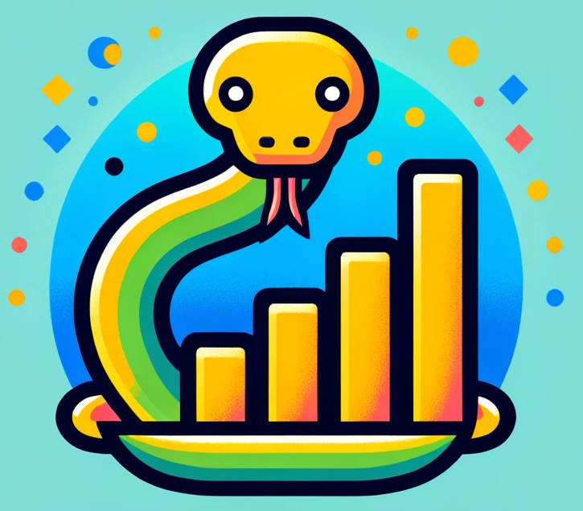

# DATA MANAGEMENT and WEB DESIGN (4TPU257U)

Welcome to the [DM WEB course](https://celcat.u-bordeaux.fr/calendar/cal?vt=agendaWeek&dt=2025-01-27&et=module&eid=-390114417:-898552971:4:1325816:23&fid0=4TPU257U%20Data%20Management%20Web%20design). In this course, you will learn how to create nice charts, graphs, and dashboards using Python. 

# Table of Contents

- [Q&A](#qa)
   - [Ok, but why is that important?](#ok-but-why-is-that-important)
   - [Nice, I'm starting to get convinced. But I'm not a computer scientist. Is this course for me?](#nice-im-starting-to-get-convinced-but-im-not-a-computer-scientist-is-this-course-for-me)
   - [What about the Web Design part? When will we create a website?](#what-about-the-web-design-part-when-will-we-create-a-website)
   - [Ok. But why Python?](#ok-but-why-python)
- [Libraries We Will Use in This Course](#libraries-we-will-use-in-this-course)
- [From Where Does the Material for This Course Come?](#from-where-does-the-material-for-this-course-come)
- [How Will I Be Evaluated?](#how-will-i-be-evaluated)
   - [About the Grades During the Course](#about-the-grades-during-the-course)
   - [Important Notes](#important-notes)
- [Course Agenda](#course-agenda)

## Q&A

### Ok, but why is that important?

Whether you have a large amount of biological data, a huge file displaying the historical data of patients in a hospital, or years of data from observing a dying star, you will need one thing: a tool to process and handle all this data. And one very important step in all these data processing activities is visualization!

Graphs move the world, and we humans are essentially flesh and bone machines that like shiny things. So, if you create beautiful graphs, people will be impressed, and you'll probably land a nice job.

### Nice, I'm starting to get convinced. But I'm not a computer scientist. Is this course for me?

YES! Of course, it is. This is a course for everyone! We will start small, with basic Python commands, only the essentials for reading, processing (just the basics), and generating charts. Things will scale up as the course progresses. So don't worry. You will have everything you need. 

### What about the Web Design part? When will we create a website?

Okay, this is a bit tricky. 'Web Design' is a very misleading name for the class I am proposing here. We will focus on data management, with the main focus on data visualization and Python tricks. BUT! There is a web component in this course, and that is the dashboards! What is a dashboard? This is a dashboard: [dashboard example](https://dash.gallery/dash-clinical-analytics/?_gl=1*1x59v97*_ga*Njg1OTYzNjM3LjE3MDEyNjkyNzI.*_ga_6G7EE0JNSC*MTcwNDQ0ODY4Ni4yLjEuMTcwNDQ0ODczNi4xMC4wLjA.)

In summary, a dashboard is an interactive tool that we can use to visualize and interact with data.

### Ok. But why Python?

Python is a very nice language. It has a huge community from all different fields. Over the years, several libraries for all types of datasets and visualizations have been built by this community, and it has become the main tool (or language) for data visualization.

Biologists? They love Python. Physicists? They don’t leave home without their Python book. Computer scientists? They love it. Philosophers? Plato was a Pythonist. So, whatever your field, Python and data visualization will be necessary. 

But, atop everything, there's another top reason: I am the teacher, and I decide the language! Go sit down, and no more questions.[^1]

## Libraries We Will Use in This Course

This is not yet a complete list of the libraries we will use in this course. The list will be updated soon:

- [pandas](https://pandas.pydata.org/): To read and process the data.
- [matplotlib](https://matplotlib.org/): To generate the graphs.
- [plotly](https://plotly.com/) and [streamlit](https://streamlit.io/): To generate dashboards.

## From Where Does the Material for This Course Come?

Currently, this course has two main sources:

1. [Python for Data Analysis: Data Wrangling with Pandas, NumPy, and Jupyter, 3rd Edition](https://wesmckinney.com/book/)
	- [Datasets from the Python for Data Analysis book](https://github.com/wesm/pydata-book)
2. [Coursera Course on Python for Data Visualization](https://www.coursera.org/learn/python-for-data-visualization)

This list will be updated throughout the course, including more advanced topics that will not be covered in the course (for students who aspire to become Python experts like Plato).

## How Will I Be Evaluated?

You will be evaluated all the time. Yes! I’m evaluating you right now, as you read this text[^1]. Okay, not *exactly* right now, but you get the idea.

### About the Grades During the Course  

You will have one primary task: exercise lists.  
“Oh no, am I going to have to do exercises every week?” – Of course not! But you will have a few lists (at least 4 of them), and your grade will be determined based on these lists. Here's how it will work:  
- I’ll give you the exercise list along with a deadline.  
- You will create a Jupyter Notebook to answer the list.  
- Once completed, send it to **luan.teylo@inria.fr**.  
- I will evaluate your submission and assign your grade.  

### Important Notes  
This is **very important**: If you don’t submit the list by the deadline, you will not receive a grade for it.  

Are the exercises tricky? No, they aren’t. The lists will cover the topics we’ve discussed in class, so don’t worry.  

To summarize: the exercises are the **only evaluation** in this course. If you complete them, I’ll be happy, you’ll be happy, and even my cat will be happy. Please don’t make my cat sad!

## Course Agenda 

1. **Getting Started**
   - Presentation of the course
   - Overview of data visualization
   - Setting up the working environment with Conda, VSCode, and Jupyter Notebook.

2. **Getting Started with Python**
   - Review of Built-in Data Structures
   - Functions
   - Files.

3. **Getting Started with Pandas**
   - Introduction to Pandas.
   - Pandas Dataframes
   - Pandas Slicing & Selecting Rows
   

4. **Getting Started with Pandas 02**
   - Join, Combine and Reshape
   - Pandas Series
   - Hierarchical indexing
   - Pandas Apply()
   - Pandas GoupBy

5. **Introduction to Types of Plots & Matplotlib**
   - Introcution to MatplotLib
   - The line plot
   - Graph Aesthetics
   - Scatter plot
  
6. **More on Matplotlib: Exploring Other Graphs**
   - Area Plots
   - Bar plot
   - Histograms 

7. **Getting Started with Iterative Plots Using the Plotly Library**  
   - Line Plot  
   - Plotly Templates  
   - Scatter Plot  
   - Bar Plot & Histograms  
   - Bubble Plot  
   - Pie Plot & Sunburst Charts  

8. **Creating Dashboards with Plotly & Streamlit – Here Comes the Web Part**  
   - Columns  
   - Sidebar  
   - Markdown  
   - Plot Integration  

---
[^1]: This is actually not a joke.